# 👋 About me 
- Learning to code for fun in my free time    
- 13 years old    
- Beginner programmer    
    
## 📌 Projects: 
### 🌐 Web:
<table border="0">
  <tr>
    <td>
      <a href="https://github.com/Alex-M-2013/MH-Assistant">
        
      </a>
    </td>
    <td>
      <a href="https://github.com/Alex-M-2013/Weather-App">
        
      </a>
    </td>
  </tr>
  <tr>
    <td>
      <a href="https://github.com/Alex-M-2013/Notes">
        
      </a>
    </td>
    <td>
      <a href="https://github.com/Alex-M-2013/Calculator">
        
      </a>
    </td>
  </tr>
  <tr>
    <td>
      <a href="https://github.com/Alex-M-2013/Coin-Clicker">
        
      </a>
    </td>
    <td>
      
    </td>
  </tr>
  <tr>
    <td>
      <a href="https://github.com/Alex-M-2013/Quiz">
        
      </a>
    </td>
    <td>
      <a href="https://github.com/Alex-M-2013/Unit-Converter">
          
      </a>
    </td>
  </tr>
</table>

### 🐍 Python:

<table border="0">
  <tr>
    <td>
      <a href="https://github.com/Alex-M-2013/ASCII-Art-Generator">
        
      </a>
    </td>
    <td>
      <a href="https://github.com/Alex-M-2013/Space-Asteroids">
        
      </a>
    </td>
  </tr>
</table>

### 📦 Others:

<table border="0">
  <tr>
    <td>
      <a href="https://github.com/Alex-M-2013/Notes-Extension">
        
      </a>
    </td>
    <td>
      <a href="https://github.com/Alex-M-2013/Password-Generator">
        
      </a>
    </td>
  </tr>
  <tr>
    <td>
    <a href="https://github.com/Alex-M-2013/Number-Guessing-Game">
        
      </a>
    </td>
  </tr>
</table>